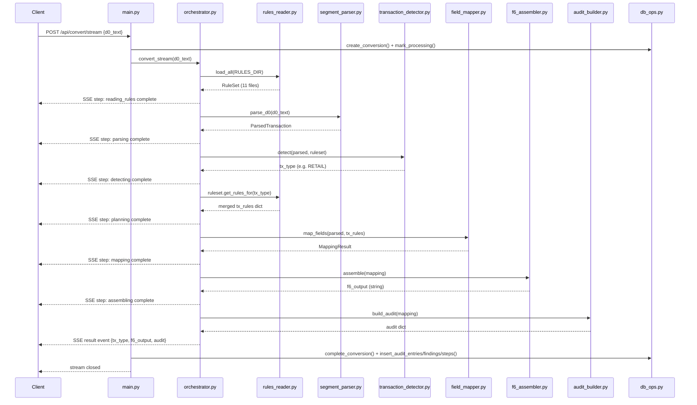
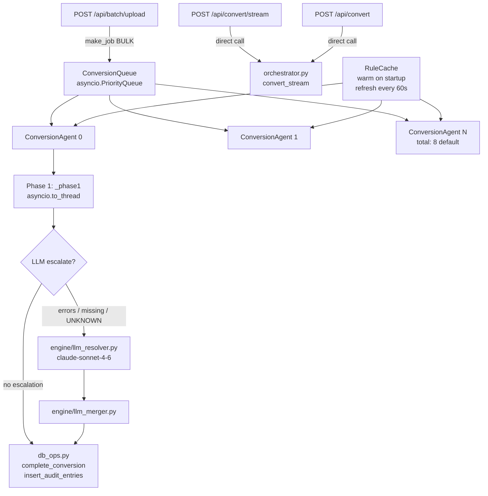

# ARCHITECTURE.md — NCPDP D.0 → F6 Conversion Engine

> All claims in this document trace to files read during the introspection pass.
> File paths are relative to the project root `/Users/dhruvsavla/Downloads/f6_conversion_engine_backend`.

---

## Section 1 — Overview

The NCPDP D.0 → F6 Conversion Engine is a FastAPI-based backend service that translates pharmacy claim transactions from the legacy NCPDP D.0 wire format into the newer F6 format (and, bidirectionally, F6 back into D.0). It is used by pharmacy billing teams and clearinghouses that must migrate from D.0 to F6 while maintaining an auditable, field-by-field change trail. The core design decision is a **deterministic rules engine as the primary conversion path**: JSON rule files in `rules/` and a seeded SQLite rule set define exactly how each field must be carried, transformed, added, removed, or modified. An LLM fallback layer (Claude `claude-sonnet-4-6` via the Anthropic API) is invoked only when Phase 1 produces errors, missing mandatory fields, or an unrecognized transaction type — and never for financial fields. Single interactive conversions use a streaming SSE path through `agent/orchestrator.py` directly; batch file uploads are processed by a pool of 8 concurrent async worker agents (`engine/agent_pool.py`) backed by a priority queue.

---

## Section 2 — Tech Stack

### Backend

| Layer | Technology | Version (pinned) | Purpose |
|---|---|---|---|
| Web framework | FastAPI | 0.111.0 | REST + SSE API |
| ASGI server | uvicorn[standard] | 0.30.0 | Production server |
| Data validation | pydantic | >=2.7.0 | Request/response schemas |
| Config | python-dotenv | 1.0.1 | `.env` loading at startup |
| Config | pyyaml | 6.0.1 | YAML support (ingestion pipeline) |
| File uploads | python-multipart | 0.0.9 | Multipart form parsing |
| LLM client | httpx | (not pinned in requirements.txt — declared in `ingestion/requirements.txt`) | Direct HTTP to Anthropic API |
| Database | SQLite | (stdlib) | Rule storage, conversion history |
| Rule ingestion LLM | Anthropic API | claude-sonnet-4-6 (hardcoded in `engine/llm_resolver.py`) | LLM hybrid resolution |

### Frontend

| Layer | Technology | Version (pinned) | Purpose |
|---|---|---|---|
| UI framework | React | ^19.2.7 | SPA shell |
| Router | react-router-dom | ^7.18.0 | Client-side routing |
| HTTP client | axios | ^1.18.1 | API calls to backend |
| Virtualized lists | @tanstack/react-virtual | ^3.14.3 | Efficient rendering of large audit tables |
| Date formatting | date-fns | ^3.6.0 | Display of timestamps |
| Build tool | react-scripts | 5.0.1 | CRA-based build |
| Testing | @testing-library/react | ^16.3.2 | Component tests |

---

## Section 3 — Directory Structure

```
f6_conversion_engine_backend/
├── main.py                        # FastAPI app, all route definitions, startup/shutdown
├── database.py                    # SQLite init, migration, seed_from_rules_folder
├── db_ops.py                      # All DB read/write functions (no business logic)
├── ncpdp_converter.db             # SQLite database file (11 tables, see Section 6)
│
├── agent/                         # Conversion pipeline modules (12 files)
│   ├── orchestrator.py            # Direct streaming pipeline (used by /api/convert/stream)
│   ├── transaction_detector.py    # Detects NCPDP transaction type from parsed tx
│   ├── rules_reader.py            # Loads + merges JSON rule files; field-level merge
│   ├── segment_parser.py          # Parses D.0 pipe-delimited text into ParsedTransaction
│   ├── field_mapper.py            # Maps ParsedTransaction fields using JSON rules
│   ├── transformer.py             # Named transform functions (ZERO_PAD_LEFT, SET_VALUE, …)
│   ├── condition_evaluator.py     # Evaluates 'condition.if' blocks in rules
│   ├── f6_assembler.py            # Assembles MappingResult → F6 text
│   ├── audit_builder.py           # Builds field-level audit trail from MappingResult
│   ├── f6_validator.py            # Validates F6 transactions (5 check categories)
│   ├── validation_orchestrator.py # Orchestrates /api/validate flow
│   ├── f6_parser.py               # Parses F6 text into ParsedTransaction
│   ├── reverse_orchestrator.py    # F6 → D.0 reverse conversion coordinator
│   ├── reverse_field_mapper.py    # Field mapping for F6 → D.0
│   ├── reverse_transformer.py     # Transform functions for reverse direction
│   ├── reverse_rules_loader.py    # Loads rules for reverse conversion
│   ├── reverse_audit_builder.py   # Audit trail for reverse conversions
│   ├── d0_assembler.py            # Assembles reverse MappingResult → D.0 text
│   └── batch_processor.py        # In-memory batch job tracking (BATCH_JOBS dict)
│
├── engine/                        # Concurrency and LLM infrastructure (8 files)
│   ├── agent_pool.py              # Pool of N ConversionAgent coroutines; startup/shutdown
│   ├── agent.py                   # Single async worker — Phase 1 + Phase 2 (LLM) logic
│   ├── job_queue.py               # Priority queue; Priority enum (URGENT/NORMAL/BULK)
│   ├── rule_cache.py              # Shared in-memory rule cache; 60-second refresh polling
│   ├── llm_resolver.py            # Claude API client; rate limiter; FINANCIAL_FIELD_IDS guard
│   ├── phi_masker.py              # HIPAA PHI masking before LLM call; 14 PHI field IDs
│   ├── llm_merger.py              # Merges LLM decisions back into partial F6 output
│   ├── metrics.py                 # Per-agent AgentMetrics dataclass (p50/p95/p99 latency)
│   └── exceptions.py             # Custom exceptions: MaxQueueDepthError, JobTimeoutError, …
│
├── rules/                         # 11 JSON rule files
│   ├── 00_global.json             # Global config (type: "global")
│   ├── 01_retail.json             # RETAIL base rules (used as base for all tx types)
│   ├── 02_specialty.json          # SPECIALTY overrides
│   ├── 03_controlled.json         # CONTROLLED overrides
│   ├── 04_cob.json                # COB overrides
│   ├── 05_reversal.json           # REVERSAL overrides
│   ├── 06_compound.json           # COMPOUND overrides
│   ├── 07_ltc.json                # LTC overrides
│   ├── 08_medicare_part_d.json    # MEDICARE_PART_D overrides
│   ├── 09_eligibility.json        # ELIGIBILITY overrides
│   └── 10_prior_auth.json         # PRIOR_AUTH overrides
│
├── seeds/
│   └── f6_standards_seeder.py     # Seeds 862-rule "NCPDP F6 Official Standards" rule set
│
├── models/
│   └── schemas.py                 # Pydantic/dataclass: MappedField, MappedSegment, MappingResult
│
├── ingestion/                     # PDF → rule JSON pipeline (separate sub-project)
│   ├── pipeline.py                # Top-level ingestion pipeline; requires ANTHROPIC_API_KEY
│   ├── ingest_api.py              # FastAPI router (included in main app)
│   ├── extractor/                 # PDF loader, LLM extractor, rule compiler, prompts
│   ├── output/                    # Rule writer; output/ dir holds raw_llm_responses/
│   ├── review/                    # Diff reporter for reviewing extracted rules
│   └── validator/                 # Rule validator for ingested rules
│
├── tools/
│   └── field_consistency_check.py # Verifies field IDs in source files exist in seeder
│
└── tests/
    └── test_parser.py             # Parser tests
```

**Rules in DB:** 1,248 rules total across 10 transaction types and up to 11 segments each. Active rule set: "NCPDP F6 Official Standards (Public Sources)" with 862 rules. Inactive rule set: "Default (from rules/ folder)" with 386 rules.

---

## Section 4 — Request Flow: Single D.0 → F6 Conversion

### Streaming path (`POST /api/convert/stream`)

The streaming endpoint calls `orchestrator.convert_stream()` **directly** — it does NOT use the agent pool. The orchestrator is a module-level async generator in `agent/orchestrator.py`. This means the streaming path does not benefit from LLM Phase 2 resolution (the direct orchestrator performs Phase 1 only).

**Step-by-step:**

1. Client sends `{d0_text: "..."}` to `POST /api/convert/stream`
2. `main.py:convert_stream()` calls `db_ops.create_conversion()` and `db_ops.mark_conversion_processing()` to create the DB record.
3. `orchestrator.convert_stream(d0_text)` is entered as an async generator. Each step yields an SSE event `{type: "step", data: {id, label, status, detail}}`:
   - **Step 1** — `rules_reader.load_all(RULES_DIR)` — loads all 11 JSON files into a `RuleSet`.
   - **Step 2** — `segment_parser.parse_d0(d0_text)` — parses pipe-delimited D.0 text into `ParsedTransaction`.
   - **Step 3** — `transaction_detector.detect(parsed, ruleset)` — detects transaction type (REVERSAL → ELIGIBILITY → PRIOR_AUTH → COMPOUND → LTC → COB → MEDICARE_PART_D → CONTROLLED → SPECIALTY → RETAIL).
   - **Step 4** — `ruleset.get_rules_for(tx_type)` — retrieves field-level-merged rules for the transaction type.
   - **Step 5** — `field_mapper.map_fields(parsed, tx_rules)` — maps each field using rule actions.
   - **Step 6** — `f6_assembler.assemble(mapping)` — assembles F6 text from `MappingResult`.
   - **Step 7** — Validation: reads `mapping.findings` (list of dicts).
   - **Step 8** — `audit_builder.build_audit(mapping)` — builds the field-level audit trail.
4. Yields a final `{type: "result", data: {transaction_type, f6_output, d0_input, audit}}` event.
5. Back in `main.py`, the route handler calls `db_ops.complete_conversion()`, `db_ops.insert_audit_entries()`, `db_ops.insert_audit_findings()`, and `db_ops.insert_agent_steps()`.
6. Each SSE frame is yielded to the client as `data: <JSON>\n\n`.

### Non-streaming path (`POST /api/convert`)

The non-streaming endpoint also calls `orchestrator.convert_stream()` directly (same async generator, consumed to completion), then returns a single JSON response with `conversion_id` and `agent_steps`.

### Batch file upload path (`POST /api/batch/upload`)

Batch uploads use the **agent pool**:

1. `main.py:batch_upload()` calls `db_ops.create_batch()`, then for each uploaded file calls `db_ops.create_conversion()` and `make_job(priority=Priority.BULK)`.
2. Each `ConversionJob` is submitted to the pool via `pool.submit(job)`.
3. A `ConversionAgent` in the pool picks up the job, calls `_execute_forward()` in `engine/agent.py`, which runs Phase 1 inside `asyncio.to_thread(_phase1, ...)` and optionally Phase 2 (LLM).

### Mermaid sequence diagram



---

## Section 5 — Multi-Agent Engine Architecture

### Configuration (from `engine/agent_pool.py` and `engine/rule_cache.py`)

| Parameter | Default | Env var | Source |
|---|---|---|---|
| Agent count | 8 | `NCPDP_AGENT_COUNT` | `agent_pool.py:31` |
| Max queue depth | 10,000 | `NCPDP_MAX_QUEUE_DEPTH` | `agent_pool.py:32` |
| Job timeout | 30 seconds | `NCPDP_JOB_TIMEOUT_S` | `agent_pool.py:33` |
| Cache refresh interval | 60 seconds | `NCPDP_CACHE_REFRESH_S` | `agent_pool.py:34` |

### Priority enum (from `engine/job_queue.py`)

```python
class Priority(IntEnum):
    URGENT = 0   # reversals (B2), eligibility (E1) — must complete fast
    NORMAL = 1   # standard single conversions
    BULK   = 2   # batch items — lower priority than individual requests
```

Auto-promotion logic in `make_job()`: if `direction == 'D0_TO_F6'` and the input contains `103-A3=B2` or `|B2|`, priority is upgraded to `URGENT`. If `batch_id is not None`, priority is set to `BULK`.

### Startup sequence (from `main.py:startup()`)

```
1. init_db()                         — create tables if needed
2. migrate_db()                      — run pending schema migrations
3. seed_from_rules_folder(RULES_DIR) — load rules/ JSON into DB (non-destructive)
4. f6_standards_seeder.seed(force=False) — seed official F6 standards rule set
5. field_consistency_check.run_check(strict=False) — verify field IDs
6. pool.start()
   a. cache.warm()                   — load active rule set from DB into memory
   b. spawn 8 ConversionAgent coroutines as asyncio Tasks
   c. spawn cache-refresh Task (polls every 60 s for rule set changes)
```

### Job flow

```
pool.submit(job)
    ↓ asyncio.PriorityQueue (sorted by priority, then submitted_at)
ConversionAgent.run() — polls queue with 1-second timeout
    ↓ _process(job)
    ↓ asyncio.wait_for(_execute(job), timeout=job.timeout_seconds)
    ↓ _execute_forward(job) or _execute_reverse(job)
    ↓ Phase 1: asyncio.to_thread(_phase1, input_text)
    ↓ Phase 2: LLM escalation (if conditions met)
    ↓ db_ops.complete_conversion() + insert audit rows
    ↓ queue.task_done(job_id)
    ↓ metrics.record(duration_ms, success)
```

### Rule cache

The `RuleCache` (`engine/rule_cache.py`) is a singleton shared by all agents. It holds all rules for the active rule set in memory as a dict keyed by `(transaction_type, segment_id)`. Agents call `cache.get_rules(tx_type, seg_id)` synchronously — no DB round-trip per conversion. The background `_refresh_cache_loop` polls `db_ops.get_active_rule_set()` every 60 seconds; if the active rule set ID changes, it reloads. The endpoint `POST /api/engine/reload-rules` forces an immediate reload.

### Mermaid diagram



---

## Section 6 — Database Schema

Database: `ncpdp_converter.db` (SQLite). Generated from `sqlite3 ncpdp_converter.db ".schema"`.

### Table: `rule_sets` — 2 rows

Tracks named rule sets. Fields: `id`, `name`, `description`, `is_active`, `version`, `created_at`, `updated_at`, `source_pdf`, `total_rules`.

| id (prefix) | name | total_rules | is_active |
|---|---|---|---|
| e353470d | Default (from rules/ folder) | 386 | 0 |
| 346cdc59 | NCPDP F6 Official Standards (Public Sources) | 862 | 1 |

### Table: `rules` — 1,248 rows

One row per field rule. Key columns: `id`, `rule_set_id` (FK→rule_sets), `transaction_type`, `segment_id`, `field_id`, `field_name`, `action`, `rule_json` (JSON blob), `mandatory_f6`, `warn_if_empty`, `warn_code`, `warn_severity`. Indexed on `(rule_set_id, transaction_type, segment_id)`.

Distribution: 10 transaction types (COB, COMPOUND, CONTROLLED, ELIGIBILITY, LTC, MEDICARE_PART_D, PRIOR_AUTH, RETAIL, REVERSAL, SPECIALTY) × up to 11 segments (CLM, COB, CMP, DUR, FAC, GLOBAL, HDR, INS, PA, PAT, PRE, PRI).

### Table: `conversions` — 59 rows

One row per conversion attempt. Key columns: `id`, `batch_id` (FK→batches), `filename`, `transaction_type`, `status` (pending/processing/success/failed), `d0_input`, `f6_output`, `d0_output`, `input_text`, `direction` (D0_TO_F6/F6_TO_D0), field-count summary columns (`fields_added`, `fields_carried`, `fields_transformed`, `fields_removed`, `fields_modified`, `fields_missing`, `warnings_count`, `errors_count`), `rule_set_version`. Three indexes: on `batch_id`, `status`, and `created_at DESC`.

### Table: `audit_entries` — 2,294 rows

One row per field-level change. Key columns: `conversion_id` (FK→conversions, CASCADE DELETE), `segment`, `occurrence`, `from_field_id`, `to_field_id`, `field_name`, `change_type`, `old_value`, `new_value`, `rule_applied`, `notes`, `condition_evaluated`, `condition_passed`, `condition_expression`.

### Table: `audit_findings` — 199 rows

Warnings and errors raised during conversion. Key columns: `conversion_id` (FK), `severity`, `code`, `message`, `segment`, `field_id`, `occurrence`.

### Table: `agent_steps` — 848 rows

Named pipeline steps recorded per conversion. Key columns: `conversion_id` (FK), `step_order`, `step_id`, `label`, `status`, `detail`.

### Table: `batches` — 2 rows

Batch job metadata. Columns: `id`, `name`, `status`, `total_files`, `completed_files`, `failed_files`, `created_at`, `completed_at`.

### Table: `validations` — 7 rows

Results from `/api/validate`. Columns: `id`, `transaction_type`, `overall_status`, `score`, `total_checks`, `passed`, `warnings`, `errors`, `rule_set_id`, `categories_json`, `checks_json`, `parse_errors_json`, `created_at`.

### Table: `llm_decisions` — 0 rows

Audit trail for LLM-assisted field resolutions. Columns: `id`, `conversion_id` (FK), `field_id`, `field_name`, `segment_id`, `resolved_value`, `original_value`, `reasoning`, `confidence`, `finding_code`, `action`, `llm_model`, `phi_was_masked`, `was_overridden`. Zero rows means LLM has not yet been invoked (requires `ANTHROPIC_API_KEY` to be set and escalation conditions to be met).

### Table: `rule_resolutions` — 0 rows

Tracks manual resolutions of flagged ingestion issues. Columns: `id`, `resolution`, `entry_id`, `field_id`, `segment_id`, `transaction_type`, `rejection_reason`, `validator_status`, `issues_json`, `resolved_at`, `resolved_by`. Zero rows — no manual resolutions recorded yet.

---

## Section 7 — Rules Engine: How a Field Gets Converted

### Overview

Field conversion has four layers:
1. **Rule files** (`rules/*.json`) — human-editable JSON defining the action for each field.
2. **Rules reader** (`agent/rules_reader.py`) — loads files and performs field-level merging.
3. **Field mapper** (`agent/field_mapper.py`) — applies rule actions to parsed fields.
4. **Transformer** (`agent/transformer.py`) — implements named transform functions.

### Field-level merge in `rules_reader.get_rules_for()`

When converting a non-RETAIL transaction type, `get_rules_for(tx_type)` merges RETAIL rules (base) with transaction-specific overrides at the **field level** — not segment level. For each segment present in either RETAIL or the tx-specific file:

- If only RETAIL has the segment: use RETAIL fields as-is.
- If only the tx-specific file has the segment: use it as-is (e.g. CMP, FAC, PA).
- If both have the segment: RETAIL field order is preserved; any field whose `field_id` matches a tx-specific rule is replaced by the tx-specific rule; tx-specific fields not in RETAIL are appended.

This guarantees that mandatory RETAIL CLM fields like `147-U7` (Pharmacy Service Type) are never silently dropped when a tx-specific CLM definition doesn't redeclare every field.

### Worked example: BIN/IIN zero-padding (`101-A1`)

**Scenario:** A RETAIL claim has `101-A1=610279` (6-digit BIN in D.0). F6 requires an 8-digit IIN.

**Rule in DB:**
```json
{
  "field_id": "101-A1",
  "field_name": "BIN / IIN Number",
  "action": "transform",
  "transform": "ZERO_PAD_LEFT",
  "params": {"length": 8},
  "notes": "6 byte BIN carried as an 8 byte IIN by left padding.",
  "transaction_type": "RETAIL",
  "segment_id": "HDR"
}
```

**Pipeline walk-through:**

1. `segment_parser.parse_d0()` parses `HDR|101-A1=610279|...` → `ParsedField(field_id="101-A1", value="610279")`.
2. `rules_reader.get_rules_for("RETAIL")` returns the HDR segment's rule list containing the above rule.
3. `field_mapper.map_fields()` iterates HDR rules; for `101-A1` it calls `_apply_rule(rule, d0_field, ...)`.
4. `action == "transform"` → `transform_name = "ZERO_PAD_LEFT"` → calls `apply_transform("610279", "ZERO_PAD_LEFT", {"length": 8})`.
5. In `agent/transformer.py`: `value.zfill(8)` → `"00610279"`.
6. Returns `MappedField(field_id="101-A1", change_type="transformed", old_value="610279", new_value="00610279", rule_applied="ZERO_PAD_LEFT")`.
7. `_bucket()` routes it to `mapped.transformed` list.
8. `f6_assembler.assemble()` serializes the mapped segment including `101-A1=00610279`.
9. `audit_builder.build_audit()` produces an audit entry: `change_type=transformed, old=610279, new=00610279, rule=ZERO_PAD_LEFT`.

The F6 sample in `main.py` confirms the output: `HDR|101-A1=00610279|102-A2=F6|...`.

### Rule action types (from `agent/field_mapper.py`)

| Action | Behavior |
|---|---|
| `carry` | Copy field value unchanged from D.0 to F6 |
| `transform` | Apply a named transform function (see below) |
| `add` | Add a new F6 field absent from D.0; use `default_value` or carry if present |
| `remove` | Mark field deprecated in F6; rendered as `~~field=value~~` in output |
| `modify` | Remap value via a `map` lookup table; `change_type=modified` if value changed |
| `cases` | Meta-action: select action based on another field's value (evaluated by `agent/condition_evaluator.py`) |

### Transform functions (from `agent/transformer.py`)

| Transform name | Behavior |
|---|---|
| `ZERO_PAD_LEFT` | Left-pad with zeros to `params.length` (default 8) |
| `SET_VALUE` | Replace with literal `params.value` |
| `REMOVE_HYPHENS` | Strip all `-` characters |
| `UPPERCASE` | Convert to uppercase |
| `LOWERCASE` | Convert to lowercase |
| `MAP_CODE` | Lookup in `params.map`; fall back to `params.default` |
| `DATE_REFORMAT` | YYYYMMDD/CCYYMMDD are identical for years 2000+ — returns value unchanged |
| `COPY_FROM_FIELD` | Read value from another segment/field in the tx (`source_field="SEG.field_id"`) |

---

## Section 8 — LLM Hybrid Resolution Layer

All files exist at the paths listed. The LLM layer is fully implemented.

### Trigger condition (from `engine/agent.py:_execute_forward()`)

LLM escalation (`should_escalate`) is triggered when **all** of the following are true:

```python
should_escalate = (
    not is_reversal                           # reversals never escalate
    and (
        len(phase1_errors) > 0                # any ERROR or CRITICAL findings
        or len(actionable_warns) > 0          # WARNs in LLM_ESCALATION_WARN_CODES
        or tx_type == 'UNKNOWN'               # unrecognized transaction type
        or llm_assist is True                 # explicit opt-in via job metadata
    )
) and llm_assist is not False                 # explicit opt-out via job metadata
```

Actionable WARN codes that trigger escalation (from `engine/agent.py:LLM_ESCALATION_WARN_CODES`):

| Code | Meaning |
|---|---|
| `DEA` | LLM knows NDC controlled-substance schedules |
| `APT` | LLM can infer Adjudicated Program Type from Medicare/Medicaid indicators |
| `BNI` | LLM can infer Benefit Network Indicator from plan context |
| `NDC` | LLM can attempt NDC correction from context |
| `QP` | LLM can infer Quantity Prescribed from days supply + quantity dispensed |
| `BRD` | LLM can infer Basis of Reimbursement from claim context |

Reversals are never escalated: `is_reversal = '103-A3=B2' in job.input_text`.

### PHI masking (from `engine/phi_masker.py`)

Before the LLM call, `mask_transaction(job.input_text)` replaces the following 14 field IDs with opaque tokens following HIPAA Safe Harbor (45 CFR §164.514(b)(2)):

`310-CA` (patient first name), `311-CB` (patient last name), `304-C4` (DOB → `19000101`), `332-CY` (patient ID), `322-CM` (address line 1), `323-CN` (address line 2), `324-CO` (city), `326-CQ` (ZIP), `329-CT` (phone → `5550100000`), `302-C2` (cardholder ID), `427-DR` (prescriber last name), `498-H2` (prescriber phone), `411-DB` (prescriber NPI), `201-B1` (pharmacy NPI).

A secondary pass masks bare SSNs matching `\d{3}-\d{2}-\d{4}`.

`unmask_llm_output()` in `engine/phi_masker.py` suppresses any LLM `resolved_value` that contains a PHI token (prevents round-trip leakage).

### Model and API call (from `engine/llm_resolver.py`)

- **Model:** `claude-sonnet-4-6` (hardcoded as `_MODEL` at line 30)
- **Endpoint:** `https://api.anthropic.com/v1/messages`
- **Max tokens:** 2,048
- **API key:** `ANTHROPIC_API_KEY` environment variable
- **Enabled flag:** `NCPDP_LLM_ENABLED` env var (default: `"true"`); set to `"false"`, `"0"`, or `"no"` to disable
- **Rate limit:** Token-bucket limiter at `NCPDP_LLM_RPM` requests per minute (default: 50)

### Financial field guard

The following field IDs are **never modified** by the LLM — attempts are logged and silently rejected:

`409-D9`, `412-DC`, `426-DQ`, `430-DU`, `423-DN`, `431-DV`, `442-E7`, and legacy aliases `D5`, `D6`, `DQ`, `D9`, `DU`.

### Decision merge (from `engine/llm_merger.py`)

`merge_llm_decisions(partial_f6_text, decisions)` iterates LLM decisions:
- For `action == "RESOLVED"` with a non-empty `resolved_value`: uses a regex to replace the existing field value in the F6 text (`field_id=<value>`). If the field is absent from the F6 text, the decision is recorded in the audit but the text is not modified.
- All decisions (resolved or not) produce an audit entry tagged with `rule_applied = "LLM:claude-sonnet-4-6:<confidence>"`.
- Returns `summary_delta = {modified: resolved_count, errors: max(0, unresolvable_count)}`.

### Rate limiting

`LLMRateLimiter` (in `engine/llm_resolver.py`) implements a token-bucket: `_rpm` tokens per 60 seconds. Default 50 RPM. Sleeps when the bucket is empty.

---

## Section 9 — Validation Pipeline

`F6Validator.validate()` signature (from `agent/f6_validator.py`):

```python
def validate(
    self,
    tx: ParsedTransaction,
    transaction_type: str,
    rule_set_id: Optional[str] = None,
) -> ValidationReport:
```

Loads the active rule set from DB if `rule_set_id` is None. Runs five check methods and sets `overall_status` to `VALID`, `VALID_WITH_WARNINGS`, or `INVALID`.

### Category 1: Structural (`_check_structural`)

Verifies required segment presence, segment occurrence limits, and HDR-first ordering.

Example check IDs:
- `STRUCT_SEG_HDR` — HDR segment must be present
- `STRUCT_SEG_CLM` — CLM segment must be present for RETAIL
- `STRUCT_OCC_DUR` — DUR segment must not appear more than 9 times
- `STRUCT_HDR_FIRST` — HDR must be the first segment

Required segments per type: RETAIL/SPECIALTY/CONTROLLED/LTC/MEDICARE_PART_D: HDR+INS+PAT+CLM+PRE+PRI; COB adds COB; COMPOUND adds CMP; PRIOR_AUTH replaces PRI with PA; REVERSAL requires only HDR+CLM; ELIGIBILITY requires only HDR+INS+PAT.

Occurrence limits: INS≤3, DUR≤9, CMP≤25, COB≤3.

### Category 2: Mandatory fields (`_check_mandatory`)

Checks every rule with `mandatory_f6=true` in the active rule set for the given transaction type. MISSING → ERROR; EMPTY → WARN; present → PASS.

Example check IDs:
- `MAND_HDR_101_A1_1` — BIN/IIN number must be present
- `MAND_CLM_402_D2_1` — Product/Service ID (NDC) must be present
- `MAND_PRE_411_DB_1` — Prescriber NPI must be present

### Category 3: Format checks (`_check_format`)

Validates field value formats using regex and code-set lookups.

Example check IDs:
- `FMT_HDR_VERSION` — `102-A2` must equal `"F6"`
- `FMT_HDR_BIN` — `101-A1` must match `^\d{8}$` (8-digit zero-padded BIN)
- `FMT_PRE_NPI` — `411-DB` must match `^\d{10}$`
- `FMT_CLM_NDC` — `402-D2` must be 11 digits, no hyphens
- `FMT_PAT_DOB` — `304-C4` must be valid CCYYMMDD
- `FMT_HDR_DOS` — `401-D1` must be valid CCYYMMDD
- `FMT_PAT_GENDER` — `305-C5` must be in `{0, 1, 2}`
- `FMT_CLM_DAW` — `408-D8` must be 0–9
- `FMT_CLM_ORIGIN` — `419-DJ` must be in `{1–5}`

### Category 4: Business rules (`_check_business`)

Conditional rules involving multiple fields or external domain knowledge.

Example check IDs:
- `BIZ_COMPOUND_CMP` — if `406-D6=2`, CMP segment must be present
- `BIZ_SPECIALTY_PA` — if SCC = 42 or 43, PA Number (`461-EU`) is required
- `BIZ_SPECIALTY_PST` — if SCC = 42 or 43, Pharmacy Service Type should be `08`
- `BIZ_PART_D_BENEFIT_STAGE` — if Medicare Part D indicator = Y, Benefit Stage Qualifier (`392-MU`) must be in COB
- `BIZ_LTC_PST_05` — if Patient Residence is an LTC code, PST should be `05`
- `BIZ_PRICING_MATH` — `409-D9 + 412-DC` should equal `430-DU`
- `BIZ_COB_OPA_NUMERIC` — `431-DV` must be numeric
- `BIZ_DEA_ABSENT` — if `441-E6` is absent, emit WARN (LLM escalates to ERROR if NDC is a scheduled drug)
- `BIZ_DEA_FORMAT` — if `441-E6` is present, must match `^[A-Z]{2}\d{7}$`

### Category 5: Deprecated fields (`_check_deprecated`)

Checks for D.0-only fields that must not appear in F6. Currently tracks one field:

- `990-MG` — "Legacy Routing Code — deprecated in F6, must not be transmitted"

Example check IDs:
- `DEPR_INS_990_MG` — ERROR if `990-MG` appears in INS segment
- `DEPR_NONE_FOUND` — PASS if no deprecated fields are detected

---

## Section 10 — Known Discrepancies

### 1. `llm_decisions` table is empty (0 rows)

The LLM resolution layer is fully implemented in `engine/llm_resolver.py`, `engine/phi_masker.py`, and `engine/llm_merger.py`, and the `llm_decisions` table schema exists. However, `ANTHROPIC_API_KEY` is not configured in the current environment, so LLM escalation has never executed. All 59 conversions in the DB were processed by Phase 1 alone.

### 2. `rule_resolutions` table is empty (0 rows)

The ingestion pipeline creates and writes to this table (via `ingestion/ingest_api.py` and `ingestion/output/rule_writer.py`), but no manual resolutions have been recorded. The table is functional but unused.

### 3. Field IDs `995-E2` and `996-E3` have inconsistent names in the DB

The active rule set contains two different rule rows for each of these field IDs in the same CLM segment for each transaction type — one from the seeder's `confirmed()` call (e.g. `995-E2` = "Route of Administration") and one from elsewhere (e.g. `995-E2` = "Specialty Pharmacy Indicator"). The `sqlite3` query shows duplicate `(transaction_type, CLM, 995-E2)` entries. Only one name can be correct for a given field ID. The F6 samples in `main.py` use `995-E2=01` and `996-E3=N` in CLM — these correspond to "Route of Administration" and "Level of Service" per the seeder at lines 534 and 544 of `seeds/f6_standards_seeder.py`. The "Specialty Pharmacy Indicator" and "REMS Authorization Number" names are likely incorrect or from a different source.

### 4. `441-E6` appears twice in the seeder at different segments

`seeds/f6_standards_seeder.py` seeds `441-E6` twice: at line 626 as "Prescriber DEA Number" (in PRE segment) and at line 739 as "Result of Service Code" (in a different segment). In NCPDP D.0/F6, `441-E6` is the Prescriber DEA Number in PRE. "Result of Service Code" is a different field (`439-E4` / `440-E5` are DUR-related codes). The DB correctly shows `441-E6` as "Prescriber DEA Number" in the PRE segment, but the second occurrence in the seeder is a labeling error. The `BIZ_DEA_ABSENT` check in `agent/f6_validator.py` reads from `tx.get_field('PRE', '441-E6')` — this is correct and consistent with the PRE-segment rule.

### 5. Field consistency checker passes but only checks 4 files

Running `tools/field_consistency_check.py` reports PASS with 97 known field IDs from the seeder, checking only `agent/f6_validator.py`, `agent/field_mapper.py`, `agent/reverse_field_mapper.py`, and `engine/agent.py`. It does not check `agent/orchestrator.py`, `agent/transformer.py`, `agent/condition_evaluator.py`, the ingestion modules, or the test files.

### 6. `F6_SAMPLES` in `main.py` use `995-E2` and `996-E3` but with ambiguous values

The F6 samples in `main.py` (lines 642, 653, 665) set `995-E2=01` and `996-E3=N` in the CLM segment. Given the naming inconsistency in discrepancy #3 above, it is unclear whether `01` is a valid "Route of Administration" code or a "Specialty Pharmacy Indicator" flag. These samples are illustrative only (they power `/api/sample-f6`) but the field naming ambiguity should be resolved in the seeder before using them as validation references.

### 7. `httpx` is used by `engine/llm_resolver.py` but not declared in the root `requirements.txt`

`engine/llm_resolver.py` imports `httpx` for the Anthropic API call. `httpx` does not appear in `requirements.txt`. It is declared in `ingestion/requirements.txt` (the ingestion sub-project). If the backend is installed from the root `requirements.txt` alone without installing ingestion dependencies, the LLM layer will fail at import time with `ModuleNotFoundError`.

### 8. Two active rule sets with different rule counts

The DB contains two rule sets: "Default (from rules/ folder)" with 386 rules and "NCPDP F6 Official Standards (Public Sources)" with 862 rules (currently active). The `/api/rules-summary` endpoint reads from the `rules/` JSON files (file-based), which would correspond to the 386-rule set, while `/api/rules` and the agent pool both use the active DB rule set (862 rules). These two surfaces can show different rule counts, which may be confusing.

### 9. Streaming endpoint (`/api/convert/stream`) does not invoke LLM Phase 2

`agent/orchestrator.py:convert_stream()` performs only Phase 1 (deterministic pipeline). LLM escalation (Phase 2) is implemented only in `engine/agent.py:_execute_forward()`, which is used by the agent pool batch path. Single conversions submitted via `/api/convert/stream` or `/api/convert` will never trigger LLM resolution, even if `ANTHROPIC_API_KEY` is set. This is an architectural gap between the two conversion paths.
