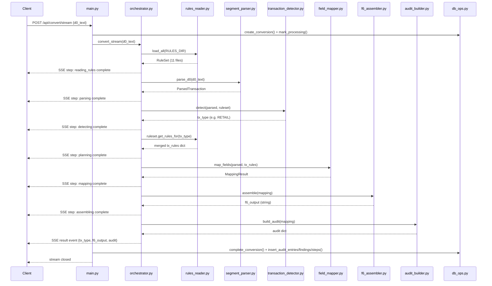
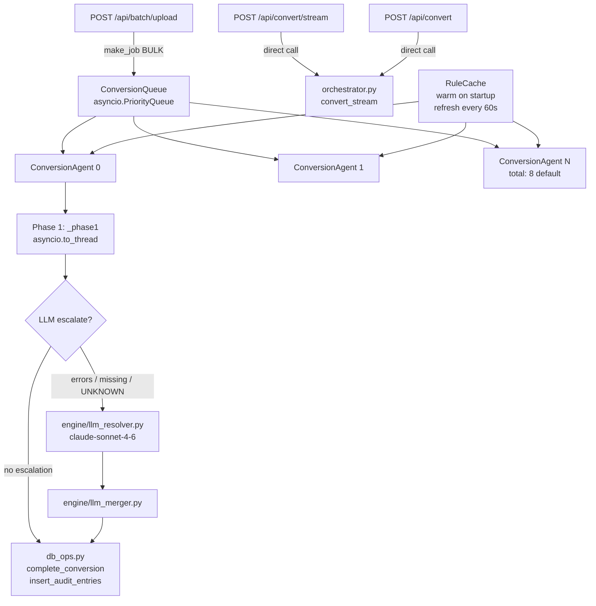

# ARCHITECTURE_DIAGRAMS.md

Mermaid diagrams extracted from ARCHITECTURE.md.
Each section label corresponds to the matching section in that document.

---

## From Section 4 — Request Flow: Single D.0 → F6 Conversion

---

## From Section 5 — Multi-Agent Engine Architecture

